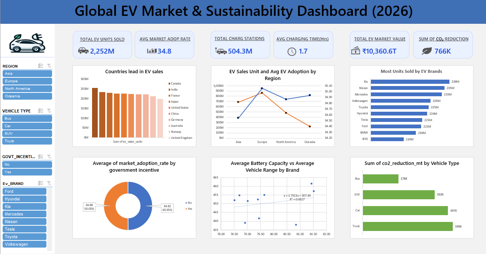

🚗 Global EV Market \& Charging Infrastructure Dashboard (Excel – 2026)

📌 Project Overview

This project analyzes the Global Electric Vehicle (EV) Market and Charging Infrastructure (2026) using Microsoft Excel.

The goal is to uncover insights related to EV sales performance, regional adoption trends, brand competitiveness, government policy impact, technology efficiency, and environmental sustainability through an interactive, KPI-driven dashboard.

This dashboard is designed as a portfolio-ready project for Data Analyst roles, showcasing strong skills in Excel analytics, KPI development, data visualization, slicer logic, and business storytelling.

📂 Dataset Details

Source: Global EV Market \& Charging Infrastructure Dataset (CSV)

Year: 2026

Granularity: Country, Region, EV Brand, Vehicle Type

Key Fields Used

EV Sales Units

Market Adoption Rate (%)

Charging Stations

Average EV Price (USD / INR)

Battery Capacity (kWh)

Vehicle Range (km)

Charging Time (Hours)

Government Incentives (Yes / No)

CO₂ Reduction (Metric Tons)

🎯 Key Performance Indicators (KPIs)

The dashboard displays the following KPIs at the top for quick, decision-oriented insights.

All KPI cards are dynamically connected to all slicers (Region, Vehicle Type, Government Incentives, EV Brand).

Total EV Sales (Units)

Represents overall EV market volume

Average Market Adoption Rate (%)

Indicates EV adoption maturity

Total Charging Stations

Measures infrastructure readiness

Average Charging Time (Hours)

Reflects charging efficiency

Total EV Market Value (INR)

Estimated using EV sales units × average EV price

Total CO₂ Reduction (Metric Tons)

Represents environmental impact of EV adoption

📊 Dashboard Visualizations \& Business Questions

1️⃣ Countries Leading in EV Sales

Business Question: Which countries lead in EV sales?

Chart Type: Clustered Column Chart

Insight: Highlights top-performing countries contributing to global EV sales.

2️⃣ EV Sales Units \& Average EV Adoption by Region

Business Question: How do EV sales and adoption vary across regions?

Chart Type: Custom Combination Chart (Columns + Line with Markers)

Insight: Compares regional sales volumes with adoption trends.

3️⃣ Most Units Sold by EV Brands

Business Question: Which EV brands dominate the market?

Chart Type: Clustered Bar Chart

Insight: Shows brand-wise sales distribution and competitive positioning.

Filters Applied:

Region slicer

EV Brand slicer

4️⃣ Impact of Government Incentives on EV Adoption

Business Question: Do government incentives influence EV adoption?

Chart Type: Doughnut Chart

Insight: Compares adoption between incentivized and non-incentivized markets.

5️⃣ Average Battery Capacity vs Average Vehicle Range by Brand

Business Question: Is higher battery capacity associated with longer vehicle range?

Chart Type: Scatter Plot

Insight: Demonstrates the relationship between battery technology and driving range.

Filters Applied:

EV Brand slicer

Vehicle Type slicer

6️⃣ CO₂ Reduction by Vehicle Type

Business Question: Which vehicle types contribute most to CO₂ reduction?

Chart Type: Clustered Bar Chart

Insight: Compares sustainability impact across Cars, SUVs, Buses, and Trucks.

🎛 Interactive Slicers (Dashboard Filters)

The dashboard includes four high-impact slicers for dynamic analysis.

🔹 Region Slicer

Filters data by Asia, Europe, North America, and Oceania.

Connected to:

Countries Leading in EV Sales (Chart 1)

EV Sales \& Adoption by Region (Chart 2)

Most Units Sold by EV Brands (Chart 3)

Impact of Government Incentives (Chart 4)

CO₂ Reduction by Vehicle Type (Chart 6)

All KPI cards

Business Value:

Enables macro-level geographic comparison across sales, brands, policy impact, and sustainability.

🔹 Vehicle Type Slicer

Filters by Car, SUV, Bus, and Truck.

Connected to:

Battery Capacity vs Vehicle Range (Chart 5)

CO₂ Reduction by Vehicle Type (Chart 6)

Countries Leading in EV Sales (Chart 1)

All KPI cards

Business Value:

Supports technology and sustainability analysis by vehicle segment.

🔹 Government Incentives Slicer

Filters by Yes / No.

Connected to:

EV Sales \& Adoption by Region (Chart 2)

Impact of Government Incentives on EV Adoption (Chart 4)

All KPI cards

Business Value:

Demonstrates the effect of policy incentives on EV adoption.

🔹 EV Brand Slicer

Filters by EV manufacturer / brand.

Connected to:

Most Units Sold by EV Brands (Chart 3)

Average Battery Capacity vs Average Vehicle Range (Chart 5)

All KPI cards

Business Value:

Enables brand-level competitive and technology analysis without affecting region- or policy-level visuals.

🧠 Key Insights

Europe shows the highest EV adoption rate supported by strong government incentives.

EV brand dominance varies significantly by region.

Cars and Trucks contribute the most to overall CO₂ reduction.

Regions with better charging infrastructure exhibit stronger EV sales.

Battery capacity and vehicle range show a positive correlation across brands.

🛠 Tools \& Techniques Used

Microsoft Excel

Pivot Tables \& Pivot Charts

KPI Cards

Slicers \& Report Connections

Custom Number Formatting

Custom Combination Charts

Data Cleaning \& Formatting

Business \& Sustainability Analysis

📈 Dashboard Features

Interactive slicers for dynamic filtering

KPI cards responsive to all slicers

Clean, business-focused layout

Multi-dimensional analysis by:

Region

Vehicle Type

Government Incentives

EV Brand

📎 Project Files

📦 Global-EV-Dashboard

 ┣ 📄 global\_ev\_market\_charging\_infrastructure\_2026.csv

 ┣ 📊 EV\_Market\_Dashboard.xlsx

 ┣ 🖼 dashboard\_screenshot.png

 ┗ 📘 README.md

💼 Resume Description

Built an interactive Excel dashboard analyzing global EV sales, adoption, infrastructure readiness, brand performance, and environmental impact using KPIs, advanced pivot charts, and dynamic slicers for business-driven insights.

🔗 Author

Sanjeev

Aspiring Data Analyst

📊 Excel | Data Analysis | Dashboarding

